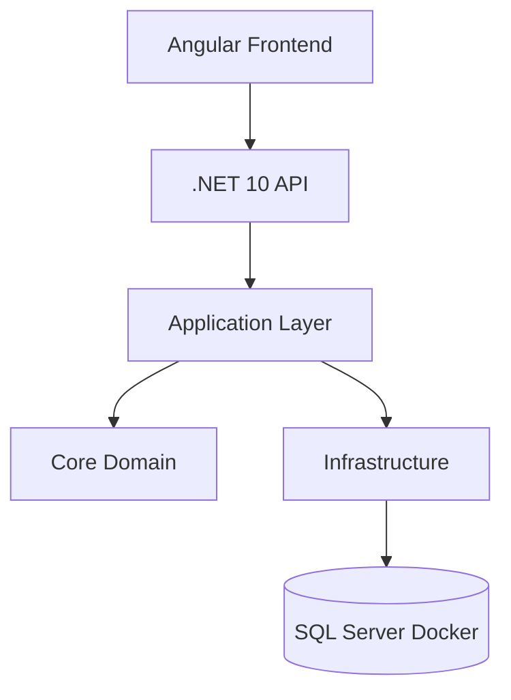
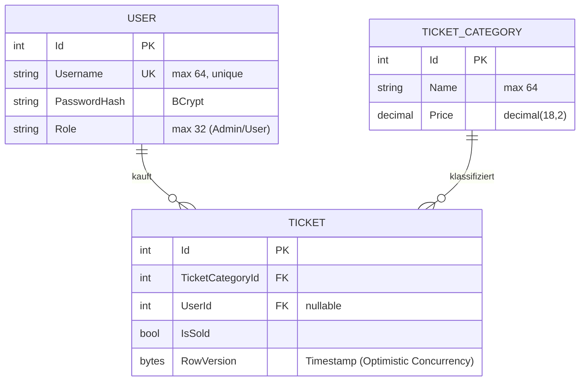
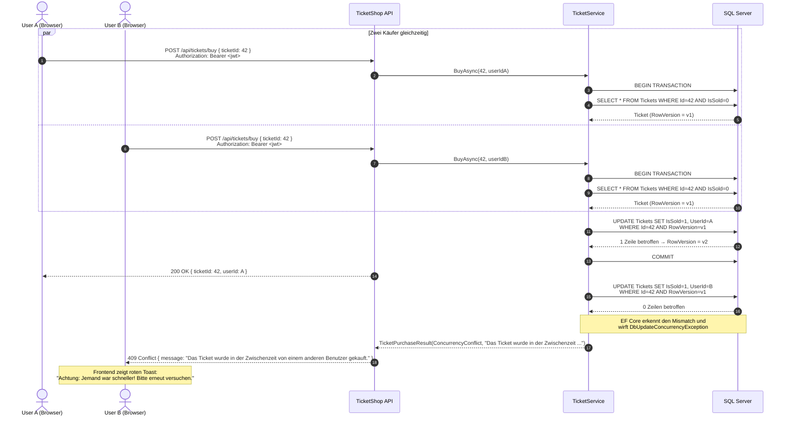

# TicketShop Applikation

> Applikation zum simultanen Verkauf von Tickets mit Concurrency Control.

---

## Inhaltsverzeichnis
- [Übersicht](#übersicht)
- [Architektur](#architektur)
- [Datenmodell (ERD)](#datenmodell-erd)
- [API-Dokumentation](#api-dokumentation)
- [Wichtige Abläufe](#wichtige-abläufe)
- [Voraussetzungen](#voraussetzungen)
- [Installation & Start](#installation--start)
- [Testbenutzer](#testbenutzer)
- [Tests ausführen](#tests-ausführen)

---

## Übersicht

TicketShop ist ein Multiuser-Ticketbuchungssystem, das im Rahmen des **uek Modul 223** entstanden ist. Die zentrale fachliche Anforderung lautet: zwei Benutzer, die zeitgleich dasselbe Ticket kaufen wollen, dürfen nicht beide erfolgreich sein. Das System löst dies über **Optimistic Concurrency Control** mit einer `[Timestamp]`-Spalte (`RowVersion`) auf der Tabelle `Tickets`. Schlägt der zweite Schreibvorgang fehl, antwortet die API mit `HTTP 409 Conflict`, und das Frontend zeigt dem User eine klare rote Meldung.

Technisch besteht das Projekt aus drei Teilen:

- **Backend** – .NET 10 Web API in Clean-Architecture-Struktur (`Core` → `Application` → `Infrastructure` → `Api`), JWT-Authentifizierung, FluentValidation, Swagger.
- **Frontend** – Angular 19 SPA mit standalone Components, JWT-Interceptor, reaktivem Formular und Toast-Feedback bei `HTTP 409`.
- **Tests** – xUnit-Unit-Tests gegen einen SQLite-In-Memory-Doppelpacker (echte RowVersion-Kollision **und** gemockter `DbUpdateConcurrencyException`-Pfad) plus einen NBomber-Lasttest, der 50 gleichzeitige User für 30 Sekunden auf den `/api/tickets/buy`-Endpoint feuert und beweist, dass es weder 5xx-Fehler noch *Lost Updates* gibt.

## Architektur



Die `Api`-Schicht hält ausschliesslich HTTP-Anliegen (Controller, Auth-Pipeline, Swagger, CORS). `Application` definiert DTOs, Service-Interfaces (`IAuthService`, `ITicketService`, `ITokenService`) und FluentValidation-Regeln. `Infrastructure` implementiert diese Services und enthält den `AppDbContext` samt EF-Core-Mapping. `Core` enthält nur reine Domain-Entities ohne EF- oder ASP.NET-Abhängigkeiten.

## Datenmodell (ERD)



Wichtig: `Ticket.RowVersion` ist als `[Timestamp]` markiert und in `OnModelCreating` mit `.IsRowVersion()` konfiguriert. SQL Server pflegt die Spalte automatisch — jede `UPDATE`-Anweisung enthält implizit `WHERE Id = @id AND RowVersion = @originalVersion`. Stimmt die Version nicht überein, sind 0 Zeilen betroffen und EF wirft eine `DbUpdateConcurrencyException`.

## API-Dokumentation

| Methode | Pfad                     | Auth         | Body                              | Antworten                                                                                                                                  |
| ------- | ------------------------ | ------------ | --------------------------------- | ------------------------------------------------------------------------------------------------------------------------------------------ |
| POST    | `/api/auth/login`        | öffentlich   | `{ "username", "password" }`      | `200 OK` `{ token, username, role }` · `401 Unauthorized` `{ message: "Ungültiger Benutzername oder Passwort." }`                          |
| GET     | `/api/tickets/available` | Bearer (JWT) | –                                 | `200 OK` `AvailableCategoryDto[]` (Kategorien mit `availableCount` und `ticketIds`) · `401 Unauthorized`                                   |
| POST    | `/api/tickets/buy`       | Bearer (JWT) | `{ "ticketId": <int, > 0> }`      | `200 OK` `{ ticketId, userId }` · `400 BadRequest` (FluentValidation) · `404 NotFound` (Ticket bereits verkauft) · **`409 Conflict`** `{ message: "Das Ticket wurde in der Zwischenzeit von einem anderen Benutzer gekauft." }` |

Die JWT-Tokens werden mit HMAC-SHA256 signiert (Secret aus `appsettings.json`, Section `Jwt`) und sind 120 Minuten gültig. Swagger UI unter `https://localhost:5001/swagger` bietet einen **Authorize**-Button oben rechts zum Einfügen des Tokens.

## Wichtige Abläufe

Der zentrale Ablauf des Kaufs mit Optimistic Concurrency Control, wenn zwei User dasselbe Ticket gleichzeitig anfragen:



## Voraussetzungen
- .NET 10 SDK
- Node.js 20+
- Docker Desktop

## Installation & Start

Repository klonen und in den Projekt-Root wechseln, dann in dieser Reihenfolge:

### 1. Datenbank starten

```bash
docker compose up -d
```

Startet den Container `ticketshop-mssql` (SQL Server 2022) auf Port `1433`. SA-Passwort: `Passwort123!`. Die Daten liegen persistent im benannten Volume `mssql_data`.

### 2. Backend starten

```bash
cd Backend
dotnet restore
dotnet run --project TicketShop.Api --launch-profile https
```

Die API hört auf `https://localhost:5001` (und `http://localhost:5000`). Beim ersten Start führt der `DbSeeder` automatisch `MigrateAsync` aus und legt zwei Test-User (`admin`/`admin`, `user`/`user`), die Kategorien **VIP** (CHF 150.00) und **Standard** (CHF 80.00) sowie 50 Tickets pro Kategorie an. Swagger-UI: `https://localhost:5001/swagger`.

### 3. Frontend starten

```bash
cd Frontend
npm install
npm start
```

Angular Dev-Server unter `http://localhost:4200`. Die API-URL ist in `Frontend/src/environments/environment.ts` als `https://localhost:5001/api` konfiguriert; CORS für diesen Origin ist in der Backend-Pipeline aktiv.

## Testbenutzer
- `admin` / `admin` (Role `Admin`)
- `user` / `user` (Role `User`)

## Tests ausführen

Alle Tests (xUnit + NBomber-Lasttest) laufen aus dem `Backend`-Ordner:

```bash
cd Backend
dotnet test
```

Erwartung: **8 / 8 grün**, Gesamtlaufzeit ca. 45 s — davon ca. 30 s NBomber-Lastlauf.

Einzelne Test-Gruppen lassen sich gezielt starten:

```bash
# Nur die TicketService Unit-Tests (Happy-Path)
dotnet test --filter "FullyQualifiedName~TicketServiceTests"

# Nur die Concurrency-Tests (inkl. BuyTicket_ConcurrentAccess_ThrowsException)
dotnet test --filter "FullyQualifiedName~Concurrency"

# Nur der NBomber-Lasttest (50 User × 30 s)
dotnet test --filter "FullyQualifiedName~TicketLoadTest"
```

Der NBomber-Lasttest läuft in-process via `WebApplicationFactory<Program>` gegen ein frisch geseedetes SQLite-In-Memory-Backend (20 000 Tickets, ein dedizierter Loaduser). Er druckt eine vollständige NBomber-Reports-Tabelle auf die Console und assertet zwei Dinge:

- **Stabilität** — `fail count == 0` (keine 5xx).
- **Keine Lost Updates** — die Anzahl `IsSold = true`-Zeilen in der Datenbank stimmt exakt mit der Anzahl `HTTP 200`-Antworten überein.
